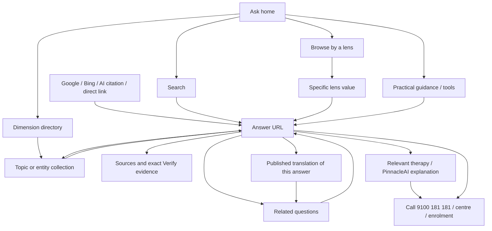

# Ask Pinnacle → shared Astro portal: verified architecture and page work order

3 October 2026. Owner-directed scope: understand the existing Ask design; preserve its answer corpus and interconnected discovery routes; bring its page families into the current Pinnacle codebase and the approved common header/footer. **Status: implemented and delivered live on 3 October 2026.** See ASK-ASTRO-RELEASE-20261003.md for source, production version, test scope and limits. The architecture findings below preserve the pre-migration baseline. The preceding search/MCP repairs are live and recorded separately in ../ask-service/README.md.

## 1. Decision and intended outcome

Keep one answer template for the public answer records, one database as the content source, and a small family of browsing templates. The page is a view of a record; a public URL is not a separately maintained source file.

The knowledge journey must be useful on its own: the visitor gets a direct answer, can understand the evidence and practical next step, and can explore the topic from another perspective. When Pinnacle services are relevant, connect that understanding to the current therapy page, PinnacleAI mechanism, Verify source, centre and a call to **9100 181 181**. Do not force every short informational answer through the entire therapy landing-page narrative.

The commercial purpose remains a useful answer → confidence → an appropriate call → centre/visit → enrolment. The child's self-sufficient, mainstream-included life gives relevant service connections their direction. Search discovery, AI citation, call clicks, connected calls and enrolments must remain separately measured.

This work inherits PINNACLE-PAGE-CREATION-WORK-ORDER.md, PORTAL-CONTEXT-AND-BUILD-MODALITY.md, AGENTS.md and COMMON-SHELL-BASELINE.md. It does not resume the held PinnacleAI scholar/Figma work, migrate Verify, replace Supabase, or retire unrelated Workers.

## 2. Verified present architecture

Evidence: exact deployed Ask bundle in ../ask-service/worker/index.js, live Supabase schema/functions and an actual browser inspection of:
https://pinnacleblooms.org/ask/what-happens-during-occupational-therapy-sessions

- 41,165 published answer records: 32,903 English and 8,262 Telugu. These are publication counts, not independent clinical reviews, indexed-page counts or unique topics.
- Ask sitemap snapshot contains 43,288 URL entries across five child sitemaps, including the Ask root. Reconcile the remaining entries against current published answers and collections. It is not an answer count and is not itself an indexability audit.
- The main answer renderer is atomPage(ctx, a), populated by ask_answer(p_slug). Its metadata/JSON-LD/share card vary by the selected record.
- There are two separately handled network-explanation URLs outside the normal renderer. Fold their approved copy into the shared answer component through explicit data overrides; preserve both URL decisions.
- Supabase contains the question-to-answer relationship, category/entity identity, intents, ages, domains, source references, translated records and cross-links.
- Relationship table totals at inspection: 63,265 question links, 55,432 question-lens assignments and 24,131 question facets. These are total rows, not a claim that every relationship points to a currently published/indexable answer.
- Database configuration has 17 dimensions and 26 lens kinds. Deployed Worker routing has 8 dimension definitions, 5 tool pages and 24 routed lens kinds. Database configuration, advertised navigation and implemented routing currently differ.
- Human answer HTML, related answers, citations, sitemap, share-card endpoints and the independent MCP endpoint are distinct outputs. They must continue to agree on the underlying public answer and canonical URL.

### Your original design, expressed plainly

1. A parent can enter through a question, condition, skill, age, everyday concern or life outcome.
2. A teacher/professional can enter through a domain, assessment, intervention, standard or classification.
3. These entrances converge on relevant question records, rather than separate disconnected article silos.
4. Each answer points back to its topic/dimension and sideways to related questions, practices, materials or other views.
5. A practical next step connects knowledge to appropriate human help.
6. Machines can retrieve the same public material through crawlable pages, structured metadata, sitemaps and MCP.

The database's category RPC already groups questions into: Understanding; Signs & concerns; Causes & influences; Assessment & diagnosis; Therapy & support; At home; Outcomes & access. These groups should be visible where they actually have published items.

## 3. Reader flowchart



This is the intended data-driven flow. The current Worker often renders static navigation for collections instead of the corresponding published questions; that gap is an explicit implementation task.

## 4. Route families to preserve and implement

The full inspected source map is ASK-ROUTE-TEMPLATE-MAP-20261003.md beside this work order. The following is the delivery inventory, not a claim that all advertised routes currently work.

| Family | URL contract | Existing role | Astro implementation |
|---|---|---|---|
| Home | /ask and existing slash/language handling | One front door; concern, child, measure, path, people and outcome entrances | AskHome.astro |
| Dimension directory | /ask/{known-dimension} | Eight existing routes: conditions, skills, abilities, domains, ages, life-skills, assessments, readiness | AskDirectory.astro + validated dimension data |
| Lens index | /ask/lens/{kind} | Browse available values for one perspective | AskLensIndex.astro |
| Lens collection | /ask/lens/{kind}/{value} | Questions matching an actual lens value | AskCollection.astro in lens mode |
| Entity/topic collection | /ask/{entity-slug} when no published answer owns that slug | A topic's questions grouped by intent | AskCollection.astro in topic mode |
| Practical/tool pages | /ask/abilityscore, /how-to, /materials, /myths, /compare beneath Ask | Distinct guidance entrances with useful answers and current service connections | AskGuide.astro with dedicated content/data |
| Search | /ask/search?q=... | Actual published-answer retrieval; noindex/follow | AskSearch.astro |
| Answer | /ask/{answer-slug}, including published translation slug | One reusable answer template | AskAnswer.astro |
| Special network answers | Two explicit existing network-explanation paths | Previously patched standalone answers | AskAnswer.astro with preserved reviewed body overrides |
| Error states | Actual missing, unpublished, unavailable and unknown routes | 404 differs from temporary 503; clear search/help | AskNotFound.astro / AskUnavailable.astro |
| Discovery and assets | Existing sitemap, robots/reading aids, images, fonts and scripts | Preserve machine contracts and image URLs | Explicit endpoint handlers / retained asset service |
| Independent AI retrieval | ask-mcp.pinnacleblooms.org/mcp | Eleven public retrieval tools | Retain separate endpoint; reuse public data contract |

### Routing precedence

Normalize host/path without changing a known canonical. Reserve the two institutional answer paths before ordinary answer lookup and the general HTML cache, so their corrected source override wins. Dispatch asset/discovery endpoints before the generic slug, then known home/search/dimension/tool/lens families. For any other remaining single slug: ask for the published answer first; only if absent resolve a known published topic collection. Unknowns get 404; database failures get 503. Avoid a catch-all that turns any unknown value into an indexable collection.

Existing apex Ask canonicals are retained in this migration. The surrounding main portal uses www; shared header/footer imports do not require a simultaneous host move. Main-site links can use their existing www canonicals. Existing www Ask redirects must continue to preserve path/query.

Do not drop a URL merely because it is absent from the sitemap. Reconcile sitemap, database, current router, Search Console, crawler failures and inbound links into one route manifest with explicit outcomes.

## 5. Current gaps that migration must fix

| Priority | Observed gap | Concrete fix |
|---|---|---|
| P0 | Old Ask has its own black header and separate footer | Import current SiteHeader and full SiteFooter including VerifyFooter directly from common source. Preserve the nine authority tiles, subtitles, font sizes, responsive menu and footer evidence controls. |
| P0 | Main portal PageLayout hardcodes www canonical, en-IN, service metadata and build-time image processing | Use an Ask layout that imports the same shared components but accepts the actual Ask canonical, language, article/collection metadata and existing image endpoint. Do not blindly wrap Ask in inappropriate Service schema. |
| P0 | Five advertised lenses are absent from the deployed route data: dev_age, organ, language, ichi, snomed | Map them to real database lenses and values, distinguish organ/body_system semantics, implement valid destinations and index only populated eligible collections. No empty success pages. |
| P0 | Advertised /ask/parents/wellbeing, /ask/access/financial and /ask/access/legal have no matching multi-segment route | Resolve each to real existing content or explicitly implement its intended collection; preserve URL contracts where they exist. Do not infer new guidance from the label alone. |
| P1 | /ask/llms-full.txt and /ask/dataset are advertised without dedicated handlers | Check whether a real public resource exists, then provide the correct explicit endpoint or remove only the misleading advertised link. A dataset page does not authorise bulk exposure of every database table. |
| P0 | Lens value route accepts unknown values and static hubs do not show actual grouped answers | Validate kind/value, fetch published members and server-render real answer links; allow noindex/404 based on explicit state. |
| P0 | ask_category exists in Supabase but is not called by the current page bundle | Use it or a bounded equivalent public RPC. Review its unused p_k argument and add bounded pagination; do not return an unbounded corpus to every visitor. |
| P0 | Multiple questions can reference one answer; ask_answer currently selects one with LIMIT 1 | Define deterministic primary metadata/parent selection; preserve all legitimate relationships separately. Do not create duplicate answer counts by naive joins. |
| P0 | Some locale links are advertised although translations are not published | Emit language options/hreflang only for real, eligible public variants; preserve canonical translation mapping. Never silently label English as another language. |
| P0 | Answer RPC provides editorial index state; sitemap/navigation and publication status can diverge | One eligibility function must govern HTML/HTTP robots, canonical, hreflang and sitemap. Published does not automatically mean indexable. |
| P1 | Old shared answer/footer counts and wording are dated | Replace shared proof blocks with current Verify data and the approved shared footer; retain definitions/as-of dates. Avoid duplicate certificate walls. |
| P1 | Live answer shows a broken literal Markdown [here](/), repeated source headings and repeated broad clinical boilerplate | Use a maintained Markdown renderer and allowlisted link handling; render optional sections once; identify record-specific issues separately from template issues. |
| P1 | Body and footer contain blanket free-check/diagnosis wording | Use confirmed offer and non-diagnostic scope; diagnose only through appropriately qualified professionals, not an exclusive institutional assertion. Correct relevant source records with an audit trail, rather than hiding them only in HTML. |
| P1 | Classification code use and source links can be broad/generic | Use exact reference pages, verified mapping/provenance and actual source scope. A code is not endorsement. Never invent an author or a completed review. |
| P1 | Some domain/entity facts are returned but not surfaced as useful links | Render relevant techniques/materials, next questions and parent collection only when resolvable and helpful. |
| P1 | Old knowledge graph conflates some organisation identities | Use current BHCL operator / Pinnacle brand / Ask knowledge service identities and stable IDs. Do not use IRWFA as equivalent sameAs solely from collaboration. |
| P2 | Dynamic SVG social cards act as dominant generic answer imagery | Retain old share URLs while improving family/topic creative placement and metadata. Generate selected complete branded creative for narrative value; do not generate thousands of near-duplicate posters. |
| P2 | Older MCP registry version differs from runtime | Existing publisher update is a separate distribution task, not a reason to replace the working MCP endpoint. |

## 6. Recommended implementation: one source base, shared components, appropriate runtime

Use the existing speech-site source and repository. Keep Supabase and Ask's successful on-demand content model. Do not build 41,165 hardcoded Astro files or make a full corpus rebuild necessary whenever one answer changes.

**Preferred first migration:** an Ask-specific Astro/Cloudflare build target within the same project, importing common components directly. Keep the current static portal build and route service intact. Replace the Ask HTML renderer behind its existing route only after acceptance; retain non-HTML asset/discovery paths and MCP separately.

Proposed source locations (not created yet):

```text
speech-site/
  src/components/SiteHeader.astro          existing common source
  src/components/SiteFooter.astro          existing common source
  src/components/VerifyFooter.astro        existing common source
  src/components/ask/
    AskHome.astro
    AskDirectory.astro
    AskLensIndex.astro
    AskCollection.astro
    AskGuide.astro
    AskSearch.astro
    AskAnswer.astro
    AskNotFound.astro
    AskUnavailable.astro
    AskNavigation.astro                    local browse/search only
    AnswerSources.astro
    RelatedAnswers.astro
    AskContact.astro
  src/layouts/AskLayout.astro               imports common header/footer
  src/lib/ask/
    repository.ts                         server-only public RPC adapter
    routes.ts
    contracts.ts
    canonical.ts
    metadata.ts
    eligibility.ts
    markdown.ts
  src/styles/ask.css                       scoped body styles
  ask-runtime/pages/[...path].astro         SSR route adapter
  astro.ask.config.mjs                     Cloudflare build target
  scripts/build-ask-route-manifest.mjs
  scripts/check-ask-contract.mjs
```

The exact file split can be refined during implementation; the contract is one maintained source for each component. Use the official compatible Astro Cloudflare adapter, pin versions, and retain the existing portal lockfile behaviour. Do not rewrite the main static build into a site-wide runtime merely to add Ask.

The runtime dispatcher imports the appropriate typed component; it must not embed one huge handwritten HTML string. A route-specific canonical/title/language is supplied before render. Use server-side data fetching so the answer and collection links exist in the initial response.

One repository may produce multiple Worker deployments. **Common ownership means common source and one release contract, not an unnecessary all-services-in-one-Worker merge.** A common-shell edit must build/release both managed portal and Ask targets from the same commit, with the same shell revision and matching assets. If either target fails acceptance, do not report the shared change as completed everywhere.

A later runtime consolidation can be considered after migration is stable; it is not required to achieve the owner's common-header/footer goal.

Current official engineering references checked:
- [Astro on-demand rendering](https://docs.astro.build/en/guides/on-demand-rendering/)
- [Official Astro Cloudflare adapter](https://docs.astro.build/en/guides/integrations-guide/cloudflare/)
- [Cloudflare service bindings](https://developers.cloudflare.com/workers/runtime-apis/bindings/service-bindings/)
- [Worker/static asset routing](https://developers.cloudflare.com/workers/static-assets/routing/worker-script/)

## 7. The answer template: block-by-block contract

The master answer is the first design/build unit. Validate representative short, long, Telugu, multi-source, no-image and in-review records against it.

| Order | Reader need | Page block and implementation requirement |
|---|---|---|
| 1 | Know where I am | Common Pinnacle header. Below it, a compact Ask search/browse strip and breadcrumb; no second full site masthead. |
| 2 | Get the answer quickly | Actual question as H1; direct summary in readable HTML; useful topic/age tags; publication/review details only when real. |
| 3 | Understand what this means for my child | The article's recognisable everyday context and useful explanation. Preserve record content and improve defects by documented record edits. |
| 4 | See the idea | One relevant illustration/diagram where it clarifies the answer. Purposeful crop, true alt text and optional caption. No mandatory enormous share poster before every short answer. |
| 5 | Understand the practical detail | Semantic H2/H3 article sections, short lists, accessible diagrams and optional contents navigation for long answers. |
| 6 | Decide what to notice/do | Optional 'What to watch' and suitable home-practice cards from actual fields. Do not invent clinical advice to fill a design slot. |
| 7 | See why Pinnacle is relevant | A concise topic-specific connection to the relevant therapy and PinnacleAI module, where it helps; exact Verify links for claims. Preserve the life outcome as purpose rather than substitute a score. |
| 8 | Check the evidence | Exact source links, source dates/status where available, truthful author/reviewer information and appropriate article licence. No synthetic human reviewers or unsupported trust badges. |
| 9 | Resolve the next doubt | Real FAQ fields, related questions, relevant materials/techniques and breadcrumb/topic links. Publish only links that resolve to eligible public destinations. |
| 10 | Take a sensible next step | Prominent call 9100 181 181, centre/visit/enrolment as appropriate, share/WhatsApp and copy-citation. No promise of availability or free offer without current source. |
| 11 | Stay inside the same Pinnacle portal | Complete common footer including Verify, citations, navigation, brand/operator, policies and contact. Do not render a second old Ask footer. |

The answer remains understandable if imagery, cookies or JavaScript fail. The commercial invitation follows useful information; it must not obscure the question with repeated general brand text.

## 8. Home, collections, guides and search

### Home

Short owned-voice introduction, working search, clear entrances for family and professional needs, featured useful questions, actual published-language availability and concise route into help. Show a limited set of understandable choices; offer the full directory accessibly. Avoid printing every possible lens as an overwhelming hero grid.

### Dimension / lens index

Explain what this way of browsing is for; show populated options with useful labels and counts; retain cross-links to sibling dimensions. Use the same validated directory component without cloning dozens of page bodies.

### Topic / lens collection

Show a real topic summary and its published questions in the seven intent groups when available. Add meaningful sibling routes and relevant therapy/Verify references. Pagination and HTML links must allow discovery beyond the first screen. Keep a stable canonical for each legitimate collection; don't create every filter combination as an indexable URL.

### Practical guide pages

AbilityScore, home practice, materials, myths and comparisons each need a distinct short purpose and useful linked content. Connect Ask explanations to the main product/service page where appropriate; do not compete with the main site's commercial canonical through generic duplicate copy.

### Search

Keep the repaired search RPC and result behaviour, noindex/follow, no-store, escaped output, real result links and explicit empty/error states. A query is not a public article and should not appear in analytics or indexing submissions. Do not add AI answer generation just to modernise a working library.

## 9. Image, icon and typography brief

- Common shell retains its approved logo, Sintony, authority tiles and full footer. Ask article body uses readable measure/line-height and the same vivid palette on white.
- Telugu uses the approved Anek Telugu typeface and a native-language readability check. Do not shrink typography to fit dense cards.
- Use icons to distinguish question, sources, practice, related topics, share and call. Text labels remain visible; colour alone is insufficient.
- Reuse suitable approved Pinnacle creatives. Commission a limited, purposeful topic-family set only after the answer template shows the needed placements.
- English new artwork uses the built-in session image tool to generate the complete branded creative, with approved logo reference, clear scene/message and full-sleeve branded professional coats. No separately billed API fallback unless newly authorised for that work.
- Do not fabricate real beneficiary identity, measured progress, regulator seals or certificates. Technical diagrams use exact text and accessible HTML/SVG where precision is needed.
- Keep existing per-answer PNG/SVG URLs operational; record image versions and update social cache deliberately. Avoid generating one new image per corpus record as a migration prerequisite.
- Set real dimensions, responsive sources/crops, hero priority only where useful, lazy loading below fold, informative alt and accessible captions.

## 10. Machine, SEO, citation, conversion and privacy acceptance

- Initial HTML includes the answer/collection links, correct H1, actual canonical, truthful title/description and legitimate language variants.
- One consistent entity graph: BHCL legal operator, Pinnacle brand, Ask knowledge service, article/collection and verified sources. Use Article/MedicalWebPage/CollectionPage as appropriate; don't use discussion QAPage merely because an editorial article answers a question.
- Match visible FAQ and breadcrumb to schema. Author/reviewer and date fields must have records. No mass refresh of last-reviewed dates on migration day.
- Article licence must cover the actual original material; do not extend CC BY to third-party logos, classifications or licensed material by inference.
- Preserve sitemap paths and eligibility; update only real changed dates. Compare old/new canonical inventory once before cutover.
- Keep llms/AI reading aids accurate, useful and bounded. They do not replace crawler access, indexable content or reputable citations.
- Check Google/Bing discoveries and crawler failures using existing tools. One IndexNow notification per materially changed canonical batch; do not repeatedly submit unchanged URLs. Record submitted, fetched, indexed, cited separately.
- Native share, WhatsApp, copy link/citation, call, centre and enrolment actions use the correct current destinations. Do not claim a call connected from a click event.
- Supabase access stays server-side and scoped to public content. No service secret enters browser JS. Draft content, private leads, child records, generation queues and query logs are outside the public data contract.
- Schema and stored Markdown/URLs are treated as data, sanitised before output. No arbitrary HTML/script interpolation.
- Retain consent and coarse analytics rules. Do not duplicate old gtag with the shared measurement script. Search queries and free-text concerns are excluded from general analytics.
- No autonomous diagnosis, care decision or fabricated outcome is added by migrating the presentation.

## 11. Finite execution sequence and completion evidence

| Batch | Deliverable | Acceptance boundary |
|---|---|---|
| A — current | Source/data architecture, route-family map, work order | Actual bundle + DB + live answer inspected. Done as documentation; not migration. |
| B | Canonical route manifest and bounded public data contracts | Known/unknown routes, publication/indexability, language and collisions resolved without writes to private data. |
| C | One complete Ask answer in common shell, local/staged only | Actual representative records; desktop/tablet/phone visual pass; citations, links and actions; no common-shell redesign. |
| D | Home, directories, collections, guides and repaired search in common shell | Real questions and next steps, valid advertised links, clear empty/error states, no generic looping doors. |
| E | Assets, sitemap, exports, caching and MCP compatibility | Retained endpoints/MIME/status/canonical and source parity; no private data or secret exposure. |
| F | One candidate production build + independent read-only review | Consolidated specific findings, one correction pass; repeat only changed/failing checks. |
| G | Commit/push candidate, CI and staged release | Saved exact revision/rollback; current 185-route table and unrelated services preserved. No --route narrowing. |
| H | Production read-back and discovery delta | Browser-rendered answer and hub, actual call/share links, assets/schema/canonical, protected portal routes and search; then targeted notification. |
| I | Close | Release receipt, actual measurements/limits, migration ledger; remove temporary artifacts only after durable source/evidence saved. |

### Required matrix, proportionate to the change

- Automated route inventory comparison across the entire known URL set; no need to render 41,165 screenshots.
- Render representatives of every template plus short/long/Telugu/missing/with-and-without-image variants.
- 320, 390, 768, 1024 and 1440 widths; Chrome/Edge, Firefox and Safari/WebKit coverage with actual tool receipts.
- Use existing TestingBot for named real Safari/iOS and Android/Chrome targets where the account/device entitlement allows it. A WebKit simulation is not a physical-iPhone pass.
- Inspect page hierarchy, typography, clipping, hero and the next section, body readability, image crops and footer initial state, not just page width and HTTP status.
- Keyboard/focus, headings, screen-reader labels, contrast, tap targets, menu behaviour and consent-dependent actions.
- Lighthouse is one lab measurement; Core Web Vitals/Search Console report actual field state when available.
- Bounded load/latency check with realistic pagination/cache. Do not hammer the public database with a crawler disguised as validation.

### Release invariants

The accepted shared shell is reused. Supabase remains intact. Existing exact answer URLs remain valid. The complete route table is preserved except for explicitly documented Ask assignments. Main portal, Verify, enrolment, books, helpline and MCP continue working. The previous Ask Worker version remains a rollback path. No claim that the migration is done until the shared shell and content are actually served publicly.

## 12. Review rubric: 100 points, evidence attached

| Perspective | Points | What must be demonstrated |
|---|---:|---|
| Parent/family usefulness and direct answer | 20 | Clear answer, dignity, useful next step, no information overload |
| Pinnacle voice and appropriate conversion | 15 | Topic-specific reason for trust and correct call/centre/enrol path |
| Knowledge graph and full route preservation | 20 | Real collections, links, translations, status and canonical contracts |
| Common-shell fidelity and visual readability | 15 | Approved shell, strong typography/creatives, phone/tablet/desktop |
| Evidence, claims and privacy | 10 | Exact sources, accurate scopes, truthful authorship, public-only data |
| SEO/AEO/citation/share readiness | 10 | Server HTML, metadata/schema, exports, sharing and discovery delta |
| Runtime/release reliability | 10 | Bounded data, cache correctness, named-browser checks and rollback |

A numerical review is an editorial/engineering assessment, not proof of ranking, AI recommendation or conversion. Critical broken routes, leaked data, an altered approved shell or unreadable content prevent release regardless of score.

## 13. Open conditions

No additional general access or new subscription is needed to begin the migration. Existing Supabase, Cloudflare, Astro, shared components and test tools cover the planned work. Any genuine external gate is recorded specifically when encountered.

The active implementation ledger must be updated before Batch B starts, preserving its existing book/PinnacleAI entries as history and the owner's hold on scholar content. This work order is the Ask contract; it does not silently overwrite other unfinished work.

The separate OpenAI directory package is still a local draft. The inspected Personal Organization plugin dashboard showed onboarding rather than an existing visible submission. Publisher verification, privacy/terms reconciliation, real connector demo, review cases and the authorised developer's legal attestations remain before public submission. This is separate from the working public MCP endpoint or search indexing.
